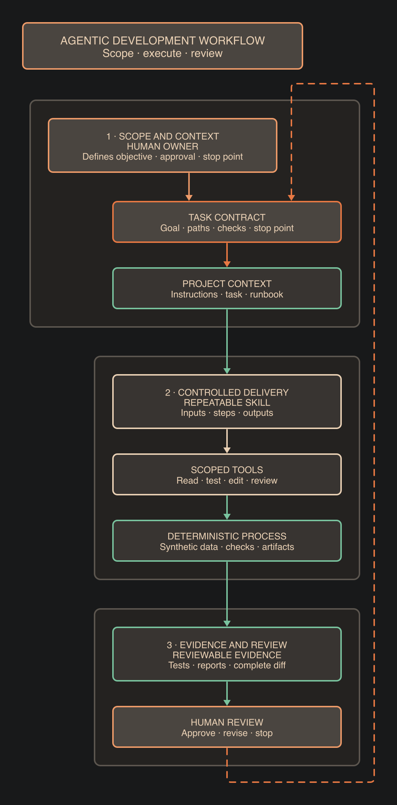

# Adopting agentic AI with evidence

This public playbook is about adopting agentic AI responsibly in real
engineering and data-science work. It focuses on the work around the model:
clear tasks, useful project context, repeatable procedures, bounded tools,
deterministic checks, review, and recorded evidence.

The material was prepared for a Department for Education demonstration. It is
independent and is not official DfE or government guidance.

## Adoption is not the outcome

Installing an agentic tool, increasing usage, or selecting a larger model does
not prove that a process became faster, safer, or more reliable. A rollout
needs observable evidence about the task result and the controls around it.

This playbook therefore treats adoption as a governed workflow:

1. define the task, owner, acceptance checks, and stopping point;
2. provide the agent with the right repository context;
3. package repeatable procedures as skills and runbooks;
4. keep deterministic work in deterministic code;
5. give the agent only the tools and permissions it needs;
6. choose capability and effort deliberately rather than maximising them;
7. inspect tests, artifacts, the complete diff, limitations, and open questions;
8. use human review before irreversible actions or publication.

The useful measures are task-level measures: acceptance checks passed, defects
found, evidence produced, risks resolved, review time, and limitations made
visible. Prompt count, login count, and model size are not outcome measures.

See [`docs/adoption-and-outcomes.md`](docs/adoption-and-outcomes.md) for the
short rationale and source note.

## The workflow and control plane



The workflow diagram is the operating model behind the demonstration:

1. **Scope and context** — a human owner defines the objective, approval, and
   stop point; the task contract records the goal, paths, checks, and boundary.
2. **Controlled delivery** — project context, a repeatable skill, scoped tools,
   and deterministic checks turn an open-ended prompt into a reviewable process.
3. **Evidence and review** — tests, reports, artifacts, and the complete diff
   make the result inspectable before a human approves, revises, or stops it.

The maintained skills support different parts of that loop:

| Skill | Contribution |
|---|---|
| `task-list-update` | records one approved subtask, evidence, status, and next decision |
| `handover` | preserves repository and session state at a stopping point |
| `model-routing` | selects separate implementation, planning, and review routes |
| `security-review` | reviews PII, secrets, hidden Unicode, injection, and limited MCP markers |
| `pipeline-run-triage` | reviews observable artifacts, thresholds, warnings, and failures |

The hook control plane adds deterministic boundaries around the agent:

| Hook | Contribution |
|---|---|
| `session-state` / `copilot_session_state.py` | supplies read-only branch, task, receipt, and working-tree context |
| `public-safety` / `copilot_pretool_check.py` | denies selected history, destructive, elevated, and install actions and applies the security contract |

Skills explain procedure; hooks enforce narrow decisions; deterministic code
produces repeatable checks; human review remains the final control.

## The actual working demo: role-based model routing

The repository includes a Copilot CLI skill and deterministic resolver for
three kinds of work:

- **implementation** — bounded coding and focused changes;
- **planning** — ambiguity, decomposition, and trade-offs;
- **review** — independent evidence, scope, and risk review.

The router is deliberately session-local. It does not create a task board,
routing ledger, or provider session. The repository has no provider-specific extension; the supported live workflow
is Copilot CLI plus the deterministic local resolver.

### Route a task by its own tags

The local `TASKS.md` is the authoritative task register for a supervised
checkout. It is intentionally ignored by Git; create it during task setup if
the checkout does not already have one. This working copy contains nine public
demo fixtures, three for each role. Their role tags are:

| Task tag | Route |
|---|---|
| `#implementer` | implementation |
| `#planner` | planning |
| `#reviewer` | review |

Other tags remain context. Point at the task; do not repeat the role tag:

`TASK.md` is the active task contract; the local `TASKS.md` remains the
register. The Copilot route command reads the contract's task ID and role tag,
maps the role to the saved assignment, and emits JSON before task work begins.
The JSON includes a model-bound execution template. Copilot launches the
bounded task in a separate model-bound process. Participants do not launch
that process from a shell; they ask Copilot to continue the routed session.

That selected model performs the task and may call Bash within its own
session. Preserve any returned session ID, usage, and tool telemetry. This
proves model launch/configuration, not provider execution attestation.

### Copilot CLI path (use this)

The Python `--interactive` mode is **real-terminal-only** because it requires
connected stdin. In Copilot, invoke the project skill and let Copilot present
choices through its user interaction.

The first step for a new piece of work is to ask Copilot:

> Create a root `TASK.md` task contract for this work. Include the Task ID,
> exactly one role tag (`#implementer`, `#planner`, or `#reviewer`), goal, files
> in scope, files unchanged, existing behaviour to preserve, acceptance checks,
> allowed commands, and stopping point. Keep `TASKS.md` as the authoritative
> register; `TASK.md` is only the active contract for this session. The
> register is local-only, so create `TASKS.md` during setup if it is absent.

Then ask Copilot to run the model-routing onboarding:

> Use the project `model-routing` skill. Run
> `python3 .github/skills/model-routing/sync_runtime_models.py`, read
> `models.runtime.json`, show me the available Copilot models and all supported
> effort levels (`none`, `minimal`, `low`, `medium`, `high`, `xhigh`, `max`),
> and ask me to choose a model and effort independently for implementation,
> planning, and review. Save each confirmed choice for this session. If
> `TASKS.md` is absent, create the local register before recording the task.

The skill calls these scripts:

| Script | Purpose | Output |
|---|---|---|
| `sync_runtime_models.py` | refresh the Copilot model snapshot | `models.raw.jsonl` and `models.runtime.json`, plus a model count |
| `model_router.py --role ... --model ... --effort ... --save-assignment` | validate and save one role assignment | JSON route confirmation and `models.assignments.json` |
| `model_router.py --task-file TASK.md` | read the active contract, map its role tag, and select the saved role route | JSON containing task ID, source, tags, role, model, provider, effort, and selection |

The runtime roster is local session evidence generated from Copilot's
available-model response; it contains no credentials. The resolver does not
activate a provider model by itself.

After the three choices are confirmed, ask:

> Read `TASK.md` and use the `model-routing` skill to route its task. Run
> `python3 .github/skills/model-routing/model_router.py --task-file TASK.md`
> and return the JSON route decision before doing any task work.

The router maps the active contract's role tag to the saved assignment:

```text
#implementer -> implementation
#planner     -> planning
#reviewer    -> review
```

At a subtask stopping point, ask Copilot:

> Use `task-list-update` to record this approved subtask, its files, checks,
> evidence, open questions, and next decision in `TASKS.md`. Then use
> `handover` to refresh the repository-root `HANDOVER.md` with the current
> task, state, files, commands, evidence, limitations, and next decision.

Expected state outputs:

- `TASK.md` — active task contract;
- local `TASKS.md` — ignored task register and dated subtask receipt;
- `HANDOVER.md` — fresh stopping-point state for resuming work;
- `models.raw.jsonl` — raw model-roster response;
- `models.runtime.json` — normalized available-model roster;
- `models.assignments.json` — session role/model/effort assignments.

### Optional user-level shortcut (run from any directory)

If you want role routing without changing into the repository each time, add a
shell function that points at your local checkout:

```bash
router-role () {
  python3 ~/Documents/agentic-development-playbook/.github/skills/model-routing/model_router.py --role "$1"
}
```

Then reload your shell and call:

```bash
router-role implementation
router-role planning
router-role review
```

To update this in the future, change only the absolute repository path in the
function. If the script gains new flags, pass them through as needed (for
example by extending the function arguments).

## Rollout path

Use the demo as a small, inspectable pilot rather than as a claim that an
organisation is ready to scale agentic AI.

### Prepare

- identify a bounded task with a human owner;
- write acceptance checks and a stopping point;
- classify work as implementation, planning, or review;
- decide what data, tools, credentials, and network access are actually needed;
- record the approved task and route in the existing project records.

### Pilot

- start in a supervised session;
- use the smallest capable model and effort;
- keep deterministic calculations and validations outside the model;
- review every proposed write and command;
- collect tests, artifacts, timings, decisions, and failure evidence;
- stop when the approved subtask is complete or a boundary is unclear.

### Review and learn

- compare the result with the acceptance checks;
- review the complete diff and the route that produced it;
- record defects, warnings, uncertainty, and open questions;
- distinguish a successful task from a successful rollout;
- change the process only when the evidence supports the change.

### Scale cautiously

Before expanding use, confirm ownership, access controls, data boundaries,
incident handling, model/provider availability, independent review, and an
approved evidence system. A local demo does not provide those production
assurances.

## Controls and boundaries

The repository demonstrates several complementary controls:

- `AGENTS.md` and `.github/copilot-instructions.md` define supervised working
  conventions;
- `.github/skills/` contains repeatable task, security, routing, and handover
  procedures;
- `.github/hooks/` contains narrow safety and session-context examples;
- `TASKS.md` records task scope, role tags, receipts, decisions, and stopping
  points;
- Copilot session assignments are stored in the ignored
  `models.assignments.json` file rather than a parallel task board;
- focused tests and complete-diff review provide evidence for changes.

The hook and security examples are deliberately narrow. They are not a full
DLP, WAF, threat-intelligence, permissions, or government-assurance system.
See [`docs/copilot-hooks.md`](docs/copilot-hooks.md) and
[`docs/security-threat-intelligence-boundary.md`](docs/security-threat-intelligence-boundary.md)
for limits and production questions.

## User-level install for all repositories

If you want the same skills and hooks in every Copilot CLI session, install a
user-level copy under `~/.copilot`.

1. Copy skills:

```bash
mkdir -p ~/.copilot/skills
cp -R .github/skills/handover \
  .github/skills/model-routing \
  .github/skills/pipeline-run-triage \
  .github/skills/security-review \
  .github/skills/task-list-update \
  ~/.copilot/skills/
```

2. Copy hook scripts:

```bash
mkdir -p ~/.copilot/hooks
cp .github/hooks/copilot_pretool_check.py ~/.copilot/hooks/
cp .github/hooks/copilot_session_state.py ~/.copilot/hooks/
```

3. Add a user-level hook config file at `~/.copilot/hooks/governed-demo-hooks.json`:

```json
{
  "version": 1,
  "hooks": {
    "sessionStart": [
      {
        "type": "command",
        "bash": "python3 ~/.copilot/hooks/copilot_session_state.py",
        "powershell": "python $HOME/.copilot/hooks/copilot_session_state.py",
        "timeoutSec": 10
      }
    ],
    "preToolUse": [
      {
        "type": "command",
        "bash": "python3 ~/.copilot/hooks/copilot_pretool_check.py",
        "powershell": "python $HOME/.copilot/hooks/copilot_pretool_check.py",
        "timeoutSec": 10
      }
    ]
  }
}
```

4. Restart Copilot CLI (or start a new session), then verify:
   - `/skills list` shows the installed user-level skills;
   - `/env` shows hooks loaded from `~/.copilot/hooks`;
   - a session starts with the `SESSION STATE (read-only)` block.

## Navigation

- [`AGENTS.md`](AGENTS.md) — repository working contract;
- local `TASKS.md` — ignored task register and router fixtures for this
  checkout;
- [`.github/skills/model-routing/SKILL.md`](.github/skills/model-routing/SKILL.md)
  — routing procedure and tag contract;
- [`runbooks/07-model-efficiency.md`](runbooks/07-model-efficiency.md) —
  capability, effort, and routing guidance;
- [`docs/adoption-and-outcomes.md`](docs/adoption-and-outcomes.md) — why
  adoption and outcomes must be measured separately;
- [`docs/copilot-hooks.md`](docs/copilot-hooks.md) — hook boundaries and
  verification limits.

## Run the complete preflight in the demo workspace

The clone includes `demo-workspace/` as an empty, tracked container for the
end-to-end rehearsal. Do not create `TASK.md`, `HANDOVER.md`, model state, or
receipts in the playbook checkout. Create a named child workspace and run the
full sequence there:

```text
Use the committed preflight fixture under preflight/. Invoke the existing
preparation script yourself to create the named disposable workspace
demo-workspace/preflight-001. Return the workspace path and do not modify the
source checkout.
```

Ask Copilot to continue the session from `demo-workspace/preflight-001/` before
continuing. The preparation script copies the toy fixture, canonical skills
and hooks, and the preflight runbook, then creates a local bootstrap commit
inside the child workspace.
The parent checkout ignores the child contents and keeps only
`demo-workspace/.gitkeep`.

### How the runbooks relate

`runbooks/10-skill-preflight.md` is the one end-to-end rehearsal. It
orchestrates the prompts and checks; participants do not run the other
runbooks as additional demos.

The other runbooks are supporting references:

- `01-copilot-cli.md` and `02-project-context.md` explain session setup and
  task scoping;
- `03-skills.md`, `04-hooks.md`, and `07-model-efficiency.md` explain the
  skills, hook boundaries, and model-routing decisions exercised by preflight;
- `06-agentic-workflow.md` describes the broader plan, implement, test, review,
  and stop lifecycle;
- `08-publication-checks.md` applies after a real change, before publication,
  and is outside this demo's stopping point;
- `05-mcp.md` covers an optional integration that is explicitly excluded from
  the default rehearsal.

Use the relevant runbook for deeper guidance on a real task; do not repeat
the preflight sequence by running every runbook. The maintained skills under
`.github/skills/` provide the reusable procedures and output contracts, while
the runbooks explain their context and broader use.

The rehearsal is intentionally end to end. In the child workspace, create and
route `TASK.md`, then run the bounded inspection, `security-review`,
`pipeline-run-triage`, `task-list-update`, the history-change boundary, and
`handover` prompts in
[`runbooks/10-skill-preflight.md`](runbooks/10-skill-preflight.md).
Model-routing is a required user-run stage: refresh the runtime roster,
choose implementation, planning, and review assignments, save them, and
return the JSON route before task work. The generated model state, task
contract, receipts, and handover remain in the child workspace.

The stages demonstrate:

| Stage | Demonstration |
|---|---|
| Prepare child | isolate rehearsal state from the source checkout |
| Create `TASK.md` | turn context into a bounded, reviewable contract |
| Model routing | choose role, model, and effort before task work |
| Bounded task | execute only the approved scope and collect evidence |
| Security review | gate model-generated content before tool or file use |
| Evidence triage | compare deterministic artifacts with thresholds |
| Task receipt | record status, checks, evidence, and the next decision |
| Hook boundary | enforce review before history-changing actions |
| Handover | preserve durable stopping-point state for resumption |

For readers who are not running the rehearsal, the frozen snapshots in
[`docs/examples/preflight-001/`](docs/examples/preflight-001/) illustrate the
end results of these stages. They are synthetic, non-authoritative reference
material and are not copied into a runnable child workspace.

The source fixture and the complete prompt sequence are documented in
[`preflight/README.md`](preflight/README.md) and
[`runbooks/10-skill-preflight.md`](runbooks/10-skill-preflight.md). Review the
child diff and remove only the named child workspace when the rehearsal is
over; keep the tracked placeholder.

No command-line setup or test command is required from the participant. Ask
Copilot to run the checks from within the child session:

```text
In the named demo-workspace child, use the preflight fixture and run its
automated checks. Report the result without modifying the source checkout's
TASKS.md or HANDOVER.md.
```

The complete sequence is in
[`preflight/README.md`](preflight/README.md) and
[`runbooks/10-skill-preflight.md`](runbooks/10-skill-preflight.md).

Maintainers may run the repository's focused checks separately; those
commands are not part of the participant rehearsal.

## Public-use rules

- keep task examples and evidence public-safe;
- do not add credentials, private endpoints, or personal data;
- do not install packages during the supervised demo;
- do not commit, push, or publish from the agent session;
- do not treat a configured model label as proof of provider availability;
- do not let routing select new work or replace human approval and review.

The examples are educational. They are not evidence of production readiness,
official policy, or successful organisational adoption.
